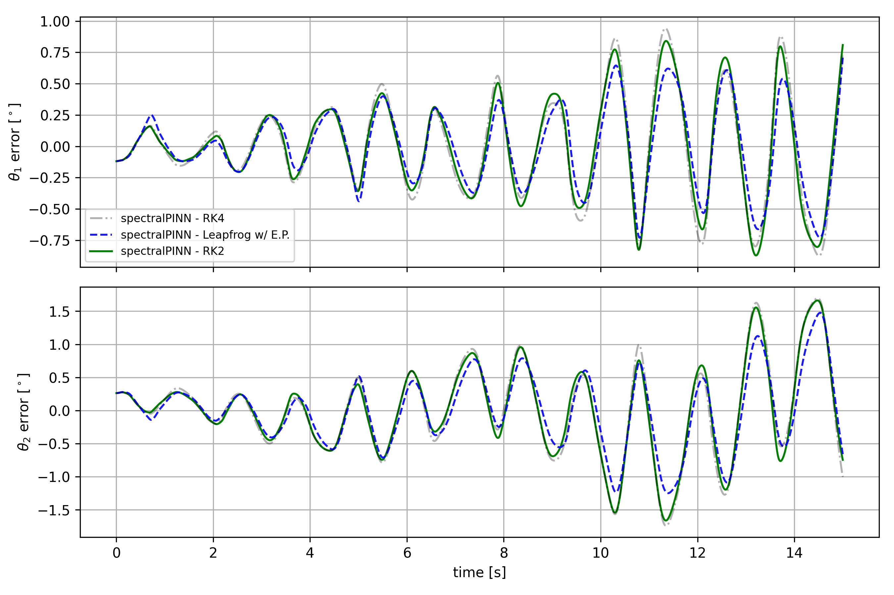

# doublePendulum_spectralPINN
Double pendulum solved using Spectral Physics-Informed Neural Networks (SpectralPINNs) - *to be released soon*

Ex1. l1=l2=1, m1=m2=1, T=15

Results of theta1 and theta2

Ex2. l1=l2=0.5, m1=m2=1, T=15

Results of theta1 and theta2

